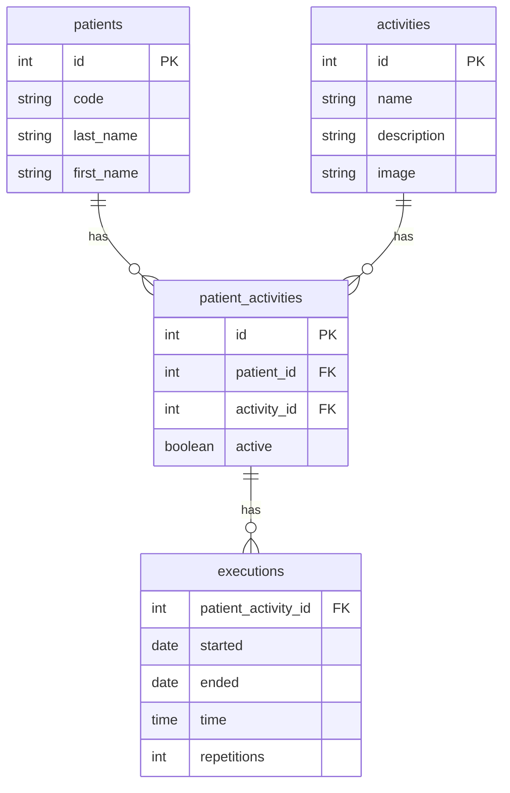

# La funcionalidad de asignación de actividades a pacientes
## Requerimientos funcionales
- El sistema debe permitir al terapeuta asignar una o más actividades a un paciente. El terapeuta debe poder ver la lista de pacientes y la lista de actividades, y asignar una o más actividades a un paciente.
- También debe poder activar o desactivar una actividad asignada a un paciente. Cuando una actividad se desactiva, el paciente no podrá verla en su lista de actividades asignadas.

## El modelo para la funcionalidad de asignación de actividades a pacientes

El modelo para la funcionalidad de asignación de actividades a pacientes está compuesto por las siguientes entidades:
- Patient
- Activity
- PatientActivity

La entidad Patient es la misma que se utiliza en la funcionalidad de registro de pacientes. La entidad Activity es la misma que se utiliza en la funcionalidad de registro de actividades. La entidad PatientActivity es una nueva entidad que se utilizará para almacenar la relación entre un paciente y una actividad.

El siguiente diagrama muestra el modelo para la funcionalidad de asignación de actividades a pacientes:


## Elementos para la nueva funcionalidad
Ejecuta el siguiente comando para crear el modelo, la migración y el seeder para la nueva funcionalidad:
```bash
php artisan make:model PatientActivity -a
```
>> Nota: Recuerda que el sufijo `-a` crea el modelo, la migración, el seeder, el controlador, el form request para creación, el form request para edición y la política para la nueva funcionalidad.

El comando anterior creará las siguientes clases para nueva funcionalidad.

- [La migración](../src/database/migrations/2024_10_22_005058_create_patient_activities_table.php)
- [El modelo](../src/app/Models/PatientActivity.php)
- [El factory](../src/database/factories/PatientActivityFactory.php)
- [El seeder](../src/database/seeders/PatientActivitySeeder.php)
- [El controlador](../src/app/Http/Controllers/PatientActivityController.php)
- [Un Form request para creación](../src/app/Http/Requests/StorePatientActivityRequest.php)
- [Un Form request para edición](../src/app/Http/Requests/UpdatePatientActivityRequest.php)
- [La Política de seguridad](../src/app/Policies/PatientActivityPolicy.php)
