# La funcionalidad de asignación de actividades a pacientes
## Requerimientos funcionales
- El sistema debe permitir al terapeuta asignar una o más actividades a un paciente. El terapeuta debe poder ver la lista de pacientes y la lista de actividades, y asignar una o más actividades a un paciente.
- Así mismo, el terapeuta debe poder describir la actividad asignada, indicando:
    - la fecha y hora en que el paciente debe realizar la actividad,
    - cantidad de repeticiones que debe realizar,
    - la duración de cada repetición,
    - los motivos por los cuales se asigna la actividad,
    - los objetivos que se esperan alcanzar con la actividad.
    - los indicadores que se utilizarán para medir el progreso del paciente.
- También debe poder activar o desactivar una actividad asignada a un paciente. Cuando una actividad se desactiva, el paciente no podrá verla en su lista de actividades asignadas.

## El modelo para la funcionalidad de asignación de actividades a pacientes
El modelo para la funcionalidad de asignación de actividades a pacientes está compuesto por las siguientes entidades:
- User
- Patient
- Activity
- PatientActivity

Las entidades User y Patient son las mismas que se utilizan en la funcionalidad de registro de usuarios y pacientes. La entidad Activity es la misma que se utiliza en la funcionalidad de registro de actividades.
Por su parte, la entidad PatientActivity es una nueva entidad que se utilizará para registrar al terapeuta que indica qué paciente realizará qué actividad.

El siguiente diagrama muestra el modelo para la funcionalidad de asignación de actividades a pacientes:

```mermaid
erDiagram
    users {
        int id PK
        string name
        string email
    }
    patients {
        int id PK
        string code
        string last_name
        string first_name
    }
    activities {
        int id PK
        string name
        string description
        string image
    }
    patient_activities {
        int id PK
        int user_id FK
        int patient_id FK
        int activity_id FK
        boolean active
        date date
        time time
        int repetitions
        time duration
        string reasons
        string goals
        string indicators
    }
    executions {
        int patient_activity_id FK
        date started
        date ended
        time time
        int repetitions
    }
    users ||--o{ patient_activities : "defines"
    patients ||--o{ patient_activities : "has"
    activities ||--o{ patient_activities : "has"
    patient_activities ||--o{ executions : "has"
    
```


## Elementos para la nueva funcionalidad
Ejecuta el siguiente comando para crear el modelo, la migración y el seeder para la nueva funcionalidad:
```bash
php artisan make:model PatientActivity -a
```
>> Nota: Recuerda que el sufijo `-a` crea el modelo, la migración, el seeder, el controlador, el form request para creación, el form request para edición y la política de seguridad para la nueva funcionalidad.

El comando anterior creará las siguientes clases para nueva funcionalidad.

- [La migración](../src/database/migrations/2024_10_22_005058_create_patient_activities_table.php)
- [El modelo](../src/app/Models/PatientActivity.php)
- [El factory](../src/database/factories/PatientActivityFactory.php)
- [El seeder](../src/database/seeders/PatientActivitySeeder.php)
- [El controlador](../src/app/Http/Controllers/PatientActivityController.php)
- [Un Form request para creación](../src/app/Http/Requests/StorePatientActivityRequest.php)
- [Un Form request para edición](../src/app/Http/Requests/UpdatePatientActivityRequest.php)
- [La Política de seguridad](../src/app/Policies/PatientActivityPolicy.php)

## Modifica la migración y el modelo
Modifica la migración y el modelo para agregar los campos necesarios para la funcionalidad de asignación de actividades a pacientes.

```php
    // En la migración
    public function up(): void
    {
        Schema::create('patient_activities', function (Blueprint $table) {
            $table->id();
            $table->foreignId('user_id')->constrained();
            $table->foreignId('patient_id')->constrained();
            $table->foreignId('activity_id')->constrained();
            $table->boolean('active')->default(false);
            $table->date('date');
            $table->integer('repetitions')->nullable();
            $table->text('reasons')->nullable();
            $table->text('goals')->nullable();
            $table->text('indicators')->nullable();
            $table->timestamps();
            $table->softDeletes();
        });
    }
```

```php
    // En el modelo
    class PatientActivity extends Model
    {
        use HasFactory;
        use SoftDeletes;

        protected $fillable = [
            'user_id',
            'patient_id',
            'activity_id',
            'active',
            'date',
            'repetitions',
            'duration',
            'reasons',
            'goals',
            'indicators',
        ];

        public function user(): BelongsTo {
            return $this->belongsTo(User::class);
        }

        public function patient(): BelongsTo {
            return $this->belongsTo(Patient::class);
        }

        public function activity(): BelongsTo {
            return $this->belongsTo(Activity::class);
        }
    }
```

## Modifica el factory y el seeder
Primero modifica el factory para que genere datos de prueba, seleccionando usuario, paciente y actividad al azar.

```php
    // En el factory
    public function definition(): array
    {
        $users = User::all();
        $patients = Patient::all();
        $activities = Activity::all();

        return [
            'user_id' => $users->random()->id,
            'patient_id' => $patients->random()->id,
            'activity_id' => $activities->random()->id,
            'active' => $this->faker->boolean,
            'date' => $this->faker->date,
            'repetitions' => $this->faker->numberBetween(1, 10),
            'reasons' => $this->faker->text,
            'goals' => $this->faker->text,
            'indicators' => $this->faker->text,
        ];
    }
```

Luego modifica el seeder para que genere datos de prueba.

```php
    // En el seeder
    public function run(): void
    {
        PatientActivity::factory(10)->create();
    }
```

Por último, asegurate de agregar la invocación al seeder desde DatabaseSeeder.php.

```php
    // En DatabaseSeeder.php
    public function run(): void {
        fake()->seed(10);
        $this->call(PermissionsSeeder::class);
        $this->call(UsersSeeder::class);
        $this->call(PatientSeeder::class);
        $this->call(ActivitySeeder::class);
        $this->call(PatientActivitySeeder::class);
    }
```

## Ejecuta las migraciones y los seeders y verifica los resultados
Ejecuta las migraciones y los seeders para crear las tablas y los datos de prueba.

```bash
src> rm ./database/database.sqlite   # Elimina la bbdd (opcional)
src> php artisan migrate --seed --force
```