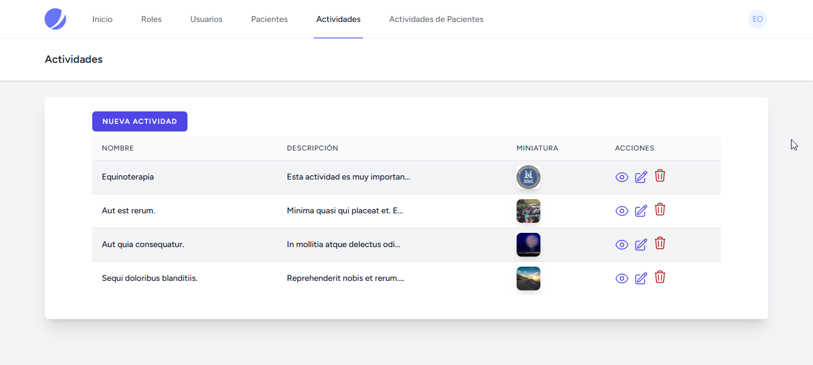

### Descripción de la Funcionalidad de Miniaturas de Imágenes

#### Objetivo
El objetivo de esta funcionalidad es permitir a los usuarios cargar imágenes de actividades y mostrar miniaturas de esas imágenes en la interfaz de usuario. Esto mejora la experiencia del usuario al proporcionar una vista previa visual de las imágenes cargadas.


### ¿Que es base64?
Base64 es un método para codificar datos binarios en un formato de texto ASCII. Se utiliza comúnmente para representar imágenes en aplicaciones web, ya que permite incrustar imágenes directamente en el código HTML o CSS. La codificación base64 convierte los datos binarios en una cadena de caracteres que contiene caracteres alfanuméricos y algunos símbolos. Por ejemplo, la cadena base64 de una imagen PNG se vería así:

```plaintext
iVBORw0KGgoAAAANSUhEUgAAABAAAAAQCAYAAAAf8/9hAAABjUlEQVQ4jY2TTUvDQBDGn
+e9z
...
```

#### Procesamiento de Imágenes en ImageUtils.php
El archivo `ImageUtils.php` contiene funciones estáticas para el procesamiento de imágenes. La función [`base64Images`](command:_github.copilot.openSymbolFromReferences?%5B%22%22%2C%5B%7B%22uri%22%3A%7B%22scheme%22%3A%22file%22%2C%22authority%22%3A%22%22%2C%22path%22%3A%22%2Fc%3A%2FUsers%2FEmilio%2FDesktop%2Fdemos%2Fteapp%2Fsrc%2Fapp%2FHttp%2FControllers%2FActivityController.php%22%2C%22query%22%3A%22%22%2C%22fragment%22%3A%22%22%7D%2C%22pos%22%3A%7B%22line%22%3A45%2C%22character%22%3A38%7D%7D%2C%7B%22uri%22%3A%7B%22scheme%22%3A%22file%22%2C%22authority%22%3A%22%22%2C%22path%22%3A%22%2Fc%3A%2FUsers%2FEmilio%2FDesktop%2Fdemos%2Fteapp%2Fsrc%2Fapp%2FUtils%2FImageUtils.php%22%2C%22query%22%3A%22%22%2C%22fragment%22%3A%22%22%7D%2C%22pos%22%3A%7B%22line%22%3A14%2C%22character%22%3A25%7D%7D%5D%2C%22720a37a5-9209-4771-bbb2-3b36efe08e0c%22%5D "Go to definition") toma una imagen en formato binario, la convierte a base64 y genera dos versiones: la original y una miniatura de 48x48 píxeles. Esta separación de responsabilidades tiene varias ventajas:

1. **Reutilización del Código**: Las funciones de procesamiento de imágenes pueden ser reutilizadas en diferentes partes de la aplicación sin duplicar código.
2. **Mantenimiento**: Facilita el mantenimiento y la actualización del código, ya que cualquier cambio en el procesamiento de imágenes se realiza en un solo lugar.
3. **Claridad**: Mejora la claridad del código, separando la lógica de negocio del procesamiento de imágenes.

#### Generación de Imágenes Aleatorias en ActivityFactory.php
En `ActivityFactory.php`, se utiliza la función [`downloadImage`](command:_github.copilot.openSymbolFromReferences?%5B%22%22%2C%5B%7B%22uri%22%3A%7B%22scheme%22%3A%22file%22%2C%22authority%22%3A%22%22%2C%22path%22%3A%22%2Fc%3A%2FUsers%2FEmilio%2FDesktop%2Fdemos%2Fteapp%2Fsrc%2Fapp%2FUtils%2FImageUtils.php%22%2C%22query%22%3A%22%22%2C%22fragment%22%3A%22%22%7D%2C%22pos%22%3A%7B%22line%22%3A10%2C%22character%22%3A27%7D%7D%2C%7B%22uri%22%3A%7B%22scheme%22%3A%22file%22%2C%22authority%22%3A%22%22%2C%22path%22%3A%22%2Fc%3A%2FUsers%2FEmilio%2FDesktop%2Fdemos%2Fteapp%2Fsrc%2Fdatabase%2Ffactories%2FActivityFactory.php%22%2C%22query%22%3A%22%22%2C%22fragment%22%3A%22%22%7D%2C%22pos%22%3A%7B%22line%22%3A11%2C%22character%22%3A30%7D%7D%5D%2C%22720a37a5-9209-4771-bbb2-3b36efe08e0c%22%5D "Go to definition") de [`ImageUtils`](command:_github.copilot.openSymbolFromReferences?%5B%22%22%2C%5B%7B%22uri%22%3A%7B%22scheme%22%3A%22file%22%2C%22authority%22%3A%22%22%2C%22path%22%3A%22%2Fc%3A%2FUsers%2FEmilio%2FDesktop%2Fdemos%2Fteapp%2Fsrc%2Fapp%2FHttp%2FControllers%2FActivityController.php%22%2C%22query%22%3A%22%22%2C%22fragment%22%3A%22%22%7D%2C%22pos%22%3A%7B%22line%22%3A8%2C%22character%22%3A14%7D%7D%2C%7B%22uri%22%3A%7B%22scheme%22%3A%22file%22%2C%22authority%22%3A%22%22%2C%22path%22%3A%22%2Fc%3A%2FUsers%2FEmilio%2FDesktop%2Fdemos%2Fteapp%2Fsrc%2Fapp%2FUtils%2FImageUtils.php%22%2C%22query%22%3A%22%22%2C%22fragment%22%3A%22%22%7D%2C%22pos%22%3A%7B%22line%22%3A8%2C%22character%22%3A6%7D%7D%2C%7B%22uri%22%3A%7B%22scheme%22%3A%22file%22%2C%22authority%22%3A%22%22%2C%22path%22%3A%22%2Fc%3A%2FUsers%2FEmilio%2FDesktop%2Fdemos%2Fteapp%2Fsrc%2Fdatabase%2Ffactories%2FActivityFactory.php%22%2C%22query%22%3A%22%22%2C%22fragment%22%3A%22%22%7D%2C%22pos%22%3A%7B%22line%22%3A4%2C%22character%22%3A14%7D%7D%5D%2C%22720a37a5-9209-4771-bbb2-3b36efe08e0c%22%5D "Go to definition") para descargar imágenes aleatorias de un servicio externo. Estas imágenes se convierten a base64 y se almacenan en los campos [`image`](command:_github.copilot.openSymbolFromReferences?%5B%22%22%2C%5B%7B%22uri%22%3A%7B%22scheme%22%3A%22file%22%2C%22authority%22%3A%22%22%2C%22path%22%3A%22%2Fc%3A%2FUsers%2FEmilio%2FDesktop%2Fdemos%2Fteapp%2Fsrc%2Fapp%2FHttp%2FControllers%2FActivityController.php%22%2C%22query%22%3A%22%22%2C%22fragment%22%3A%22%22%7D%2C%22pos%22%3A%7B%22line%22%3A43%2C%22character%22%3A32%7D%7D%2C%7B%22uri%22%3A%7B%22scheme%22%3A%22file%22%2C%22authority%22%3A%22%22%2C%22path%22%3A%22%2Fc%3A%2FUsers%2FEmilio%2FDesktop%2Fdemos%2Fteapp%2Fsrc%2Fdatabase%2Ffactories%2FActivityFactory.php%22%2C%22query%22%3A%22%22%2C%22fragment%22%3A%22%22%7D%2C%22pos%22%3A%7B%22line%22%3A16%2C%22character%22%3A13%7D%7D%2C%7B%22uri%22%3A%7B%22scheme%22%3A%22file%22%2C%22authority%22%3A%22%22%2C%22path%22%3A%22%2Fc%3A%2FUsers%2FEmilio%2FDesktop%2Fdemos%2Fteapp%2Fsrc%2Fresources%2Fviews%2Factivities%2Findex.blade.php%22%2C%22query%22%3A%22%22%2C%22fragment%22%3A%22%22%7D%2C%22pos%22%3A%7B%22line%22%3A33%2C%22character%22%3A43%7D%7D%5D%2C%22720a37a5-9209-4771-bbb2-3b36efe08e0c%22%5D "Go to definition") y [`thumbnail`](command:_github.copilot.openSymbolFromReferences?%5B%22%22%2C%5B%7B%22uri%22%3A%7B%22scheme%22%3A%22file%22%2C%22authority%22%3A%22%22%2C%22path%22%3A%22%2Fc%3A%2FUsers%2FEmilio%2FDesktop%2Fdemos%2Fteapp%2Fsrc%2Fapp%2FHttp%2FControllers%2FActivityController.php%22%2C%22query%22%3A%22%22%2C%22fragment%22%3A%22%22%7D%2C%22pos%22%3A%7B%22line%22%3A48%2C%22character%22%3A20%7D%7D%2C%7B%22uri%22%3A%7B%22scheme%22%3A%22file%22%2C%22authority%22%3A%22%22%2C%22path%22%3A%22%2Fc%3A%2FUsers%2FEmilio%2FDesktop%2Fdemos%2Fteapp%2Fsrc%2Fapp%2FUtils%2FImageUtils.php%22%2C%22query%22%3A%22%22%2C%22fragment%22%3A%22%22%7D%2C%22pos%22%3A%7B%22line%22%3A31%2C%22character%22%3A13%7D%7D%2C%7B%22uri%22%3A%7B%22scheme%22%3A%22file%22%2C%22authority%22%3A%22%22%2C%22path%22%3A%22%2Fc%3A%2FUsers%2FEmilio%2FDesktop%2Fdemos%2Fteapp%2Fsrc%2Fdatabase%2Ffactories%2FActivityFactory.php%22%2C%22query%22%3A%22%22%2C%22fragment%22%3A%22%22%7D%2C%22pos%22%3A%7B%22line%22%3A17%2C%22character%22%3A13%7D%7D%5D%2C%22720a37a5-9209-4771-bbb2-3b36efe08e0c%22%5D "Go to definition") de la base de datos. Esto permite generar datos de prueba realistas para las actividades.

#### Métodos `store()` y `update()` en ActivityController.php

- **Método `store()`**:
  - Recibe una solicitud con una imagen.
  - Lee el contenido de la imagen y lo convierte a base64 utilizando `ImageUtils::base64Images`.
  - Valida los datos de la solicitud y agrega las versiones base64 de la imagen y la miniatura.
  - Crea una nueva actividad en la base de datos con los datos validados.

- **Método `update()`**:
  - Similar al método `store()`, pero actualiza una actividad existente.
  - Si se proporciona una nueva imagen, se procesa y se actualizan los campos [`image`](command:_github.copilot.openSymbolFromReferences?%5B%22%22%2C%5B%7B%22uri%22%3A%7B%22scheme%22%3A%22file%22%2C%22authority%22%3A%22%22%2C%22path%22%3A%22%2Fc%3A%2FUsers%2FEmilio%2FDesktop%2Fdemos%2Fteapp%2Fsrc%2Fapp%2FHttp%2FControllers%2FActivityController.php%22%2C%22query%22%3A%22%22%2C%22fragment%22%3A%22%22%7D%2C%22pos%22%3A%7B%22line%22%3A43%2C%22character%22%3A32%7D%7D%2C%7B%22uri%22%3A%7B%22scheme%22%3A%22file%22%2C%22authority%22%3A%22%22%2C%22path%22%3A%22%2Fc%3A%2FUsers%2FEmilio%2FDesktop%2Fdemos%2Fteapp%2Fsrc%2Fdatabase%2Ffactories%2FActivityFactory.php%22%2C%22query%22%3A%22%22%2C%22fragment%22%3A%22%22%7D%2C%22pos%22%3A%7B%22line%22%3A16%2C%22character%22%3A13%7D%7D%2C%7B%22uri%22%3A%7B%22scheme%22%3A%22file%22%2C%22authority%22%3A%22%22%2C%22path%22%3A%22%2Fc%3A%2FUsers%2FEmilio%2FDesktop%2Fdemos%2Fteapp%2Fsrc%2Fresources%2Fviews%2Factivities%2Findex.blade.php%22%2C%22query%22%3A%22%22%2C%22fragment%22%3A%22%22%7D%2C%22pos%22%3A%7B%22line%22%3A33%2C%22character%22%3A43%7D%7D%5D%2C%22720a37a5-9209-4771-bbb2-3b36efe08e0c%22%5D "Go to definition") y [`thumbnail`](command:_github.copilot.openSymbolFromReferences?%5B%22%22%2C%5B%7B%22uri%22%3A%7B%22scheme%22%3A%22file%22%2C%22authority%22%3A%22%22%2C%22path%22%3A%22%2Fc%3A%2FUsers%2FEmilio%2FDesktop%2Fdemos%2Fteapp%2Fsrc%2Fapp%2FHttp%2FControllers%2FActivityController.php%22%2C%22query%22%3A%22%22%2C%22fragment%22%3A%22%22%7D%2C%22pos%22%3A%7B%22line%22%3A48%2C%22character%22%3A20%7D%7D%2C%7B%22uri%22%3A%7B%22scheme%22%3A%22file%22%2C%22authority%22%3A%22%22%2C%22path%22%3A%22%2Fc%3A%2FUsers%2FEmilio%2FDesktop%2Fdemos%2Fteapp%2Fsrc%2Fapp%2FUtils%2FImageUtils.php%22%2C%22query%22%3A%22%22%2C%22fragment%22%3A%22%22%7D%2C%22pos%22%3A%7B%22line%22%3A31%2C%22character%22%3A13%7D%7D%2C%7B%22uri%22%3A%7B%22scheme%22%3A%22file%22%2C%22authority%22%3A%22%22%2C%22path%22%3A%22%2Fc%3A%2FUsers%2FEmilio%2FDesktop%2Fdemos%2Fteapp%2Fsrc%2Fdatabase%2Ffactories%2FActivityFactory.php%22%2C%22query%22%3A%22%22%2C%22fragment%22%3A%22%22%7D%2C%22pos%22%3A%7B%22line%22%3A17%2C%22character%22%3A13%7D%7D%5D%2C%22720a37a5-9209-4771-bbb2-3b36efe08e0c%22%5D "Go to definition").

#### Plantilla Blade index.blade.php
En la plantilla `index.blade.php`, se agregó una columna para mostrar la miniatura de cada actividad. Esto se hace de la siguiente manera:

1. **Encabezado de la Tabla**: Se añadió una columna con el título "Miniatura".
2. **Cuerpo de la Tabla**: Para cada actividad, se muestra la miniatura utilizando una etiqueta `` con el atributo `src` configurado con la versión base64 de la miniatura.

```blade
<td class="px-4 py-2 whitespace-nowrap text-sm font-medium text-gray-900">
    thumbnail }}" alt="{{ $activity->name }}"
        class="w-10 h-10 object-cover rounded-lg shadow-lg">
</td>
```

### Resumen

- **ImageUtils.php**: Centraliza el procesamiento de imágenes, mejorando la reutilización y el mantenimiento del código.
- **ActivityFactory.php**: Genera imágenes aleatorias para datos de prueba.
- **Métodos `store()` y `update()`**: Procesan y almacenan imágenes y miniaturas en la base de datos.
- **index.blade.php**: Muestra las miniaturas de las actividades en una tabla.

Esta estructura modular y clara facilita la comprensión y el mantenimiento del código, además de proporcionar una experiencia de usuario enriquecida al mostrar miniaturas de las imágenes subidas.